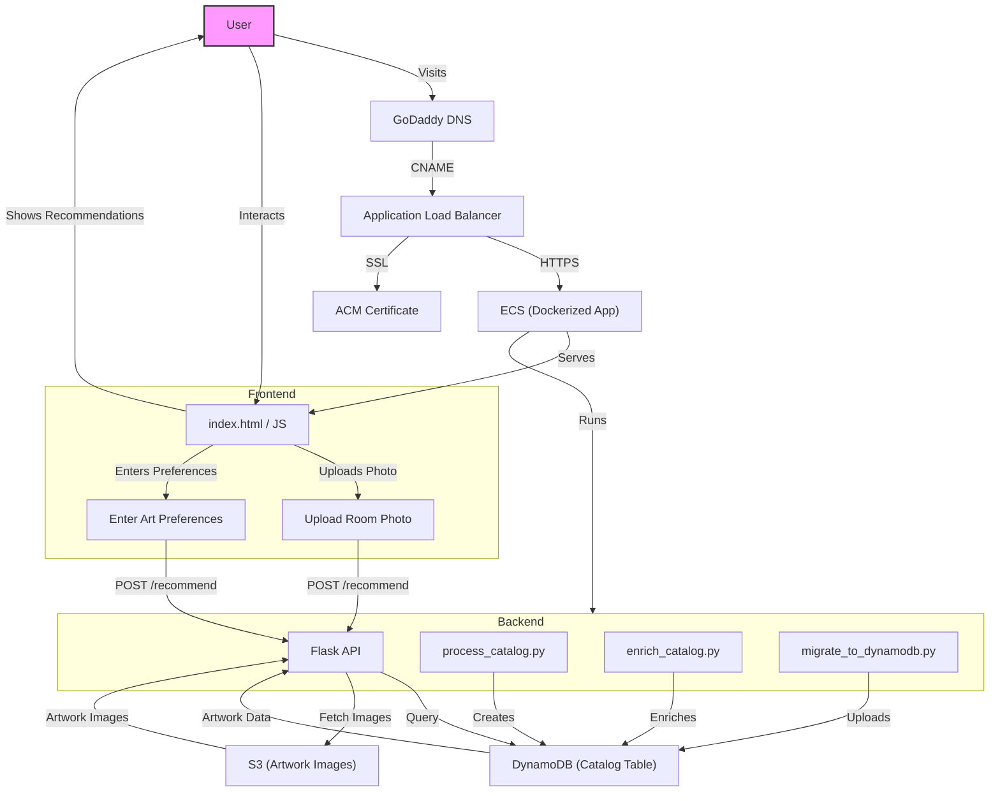

# taberner_studio_app

## Project Structure

```
taberner_studio_app/
├── aws/                          # AWS Infrastructure & Deployment
│   ├── deploy_to_ecs.sh         # ECS deployment script
│   ├── ecs-service-definition.json
│   ├── ecs-task-definition.json
│   ├── s3-cors-config.json      # S3 CORS configuration
│   ├── setup_https_*.sh         # HTTPS setup scripts
│   ├── monitor_app.py           # Monitoring utilities
│   ├── verify_dynamodb.py       # DynamoDB verification
│   └── AWS_MIGRATION_GUIDE.md   # AWS migration documentation
├── backend/                      # Backend Application
│   ├── app.py                   # Local development server
│   ├── app_aws.py               # Production server (Docker)
│   ├── catalog/                 # Local catalog data
│   │   ├── catalog.json         # Artwork catalog
│   │   └── images/              # Artwork images
│   ├── process_catalog.py       # Generate catalog from images
│   ├── enrich_catalog.py        # Add AI metadata to catalog
│   ├── migrate_to_dynamodb.py   # Upload catalog to DynamoDB
│   └── requirements_*.txt       # Python dependencies
├── frontend/                     # Frontend Application
│   ├── index.html               # Main application page
│   ├── script.js                # Frontend JavaScript
│   ├── style.css                # Frontend styles
│   ├── config.js                # Configuration
│   ├── preview.html             # Preview page
│   └── assets/                  # Static assets
├── buildspec.yml                # AWS CodeBuild configuration
├── README.md                     # This file
└── .gitignore                   # Git ignore rules
```

## Quick Start

### Local Development

1. **Start the backend server:**
   ```bash
   python backend/app.py
   ```

2. **Open the application:**
   - Navigate to `http://localhost:8000` in your browser
   - Or use the preview page: `http://localhost:8000/preview.html`

### AWS Infrastructure Management

**Deploy to ECS:**
```bash
./aws/deploy_to_ecs.sh
```

**Configure S3 CORS (for image access):**
```bash
aws s3api put-bucket-cors --bucket your-bucket-name --cors-configuration file://aws/s3-cors-config.json --region us-east-1
```

**Monitor the application:**
```bash
python aws/monitor_app.py
```

**Verify DynamoDB setup:**
```bash
python aws/verify_dynamodb.py
```

**Setup HTTPS for custom domain:**
```bash
./aws/setup_https_for_domain.sh
```

## Backend Files

The project uses different backend files for different environments:

| File | Purpose | Environment | Data Source |
|------|---------|-------------|-------------|
| `backend/app.py` | Local development server | Development | Local `catalog.json` |
| `backend/app_aws.py` | Production server | AWS ECS | DynamoDB |

**Key Differences:**
- **`app.py`**: Uses local JSON catalog, no AWS services, for development
- **`app_aws.py`**: Uses DynamoDB, includes AWS services (S3, Rekognition), for production

**API Endpoints (both files):**
- `GET /` - Serve frontend
- `POST /recommend` - Get artwork recommendations
- `GET /api/preferences-options` - Get available preferences
- `GET /catalog/images/<filename>` - Serve catalog images
- `GET /health` - Health check (production only)

## Catalog Workflow

### 1. Create `catalog.json`
- Place your artwork images in `backend/catalog/images/`.
- Run the following script to generate `catalog.json` with basic metadata and dominant color extraction:
  ```bash
  python backend/process_catalog.py
  ```
- This will create or overwrite `backend/catalog/catalog.json` with entries for each image.

### 2. Enrich the Catalog with AI Metadata
- To add AI-generated style and subject attributes to each artwork, run:
  ```bash
  python backend/enrich_catalog.py
  ```
- This uses a CLIP model to classify each image and updates the `attributes` field in `catalog.json`.
- Ensure you have the required dependencies (`transformers`, `torch`, `Pillow`).

### 3. Deploy/Update Catalog Data to DynamoDB
- To upload or update your catalog data in DynamoDB, run:
  ```bash
  python backend/migrate_to_dynamodb.py
  ```
- This script will:
  - Create the DynamoDB table if it does not exist.
  - Insert or update each item from `catalog.json` (using the `id` as the key).
  - Verify that the number of items matches between the file and the table.
- Make sure your AWS credentials are configured and you have the necessary permissions.

---

For more details, see the docstrings at the top of each script in `backend/`.

---

## Deploying New Changes to AWS (with CodeBuild)

1. **Commit and Push Your Changes**
   - Make sure all your code, frontend, and backend changes are committed and pushed to your main branch on GitHub.

2. **AWS CodeBuild Pipeline**
   - Your repository should be connected to an AWS CodeBuild project.
   - CodeBuild will automatically build your Docker image, push it to ECR, and deploy to ECS when changes are pushed to the main branch (or your configured branch).
   - The build process is defined in `buildspec.yml`.

3. **Monitor the Build**
   - Go to the AWS Console → CodeBuild → Your Project.
   - Watch the build logs for errors or successful completion.

4. **ECS Service Update**
   - After a successful build, ECS will pull the new Docker image and update the running service.
   - You can monitor the deployment in the ECS Console under your cluster and service.

5. **Verify the Deployment**
   - Visit your application at your custom domain or ALB DNS name to ensure the new changes are live.
   - Check CloudWatch logs for any runtime errors.

**Note:**
- If you need to trigger a manual build, you can do so from the CodeBuild Console.
- Make sure your IAM roles and permissions are set up for CodeBuild, ECR, and ECS access.

---

## System Architecture & Recommendation Flow



---